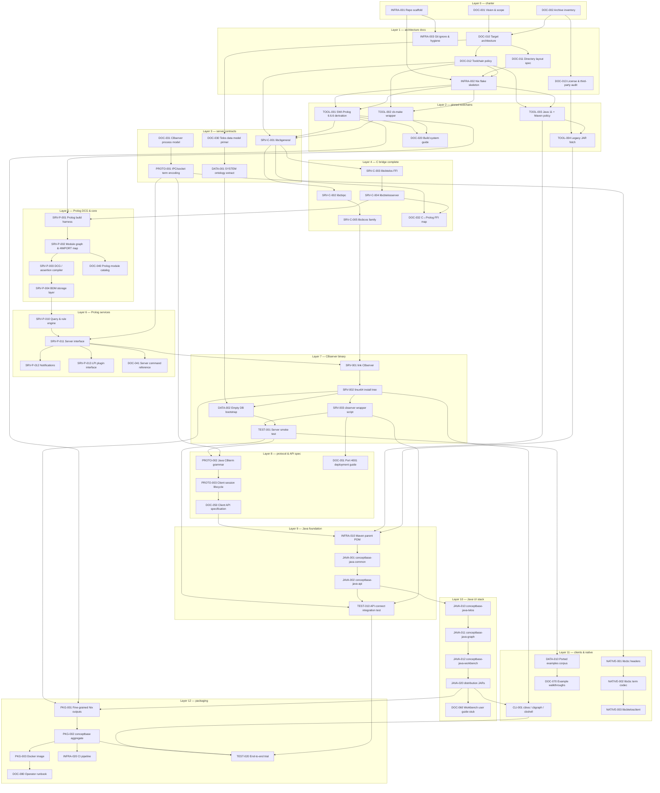
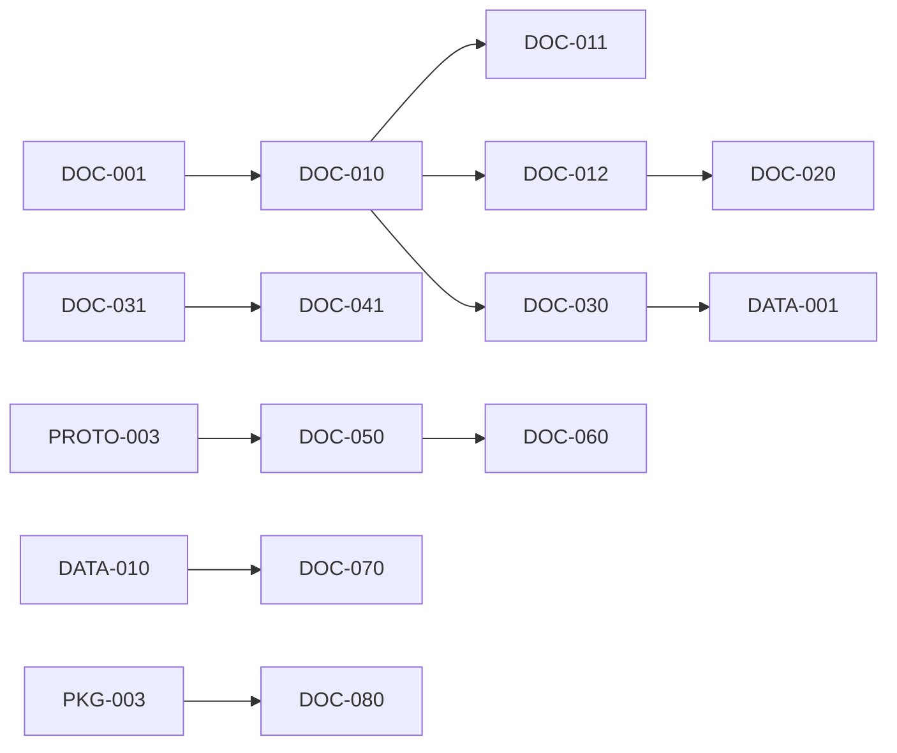
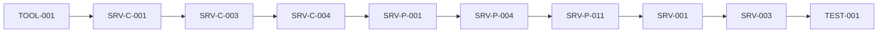
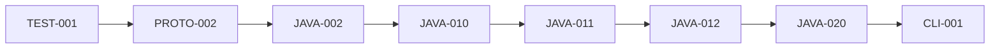
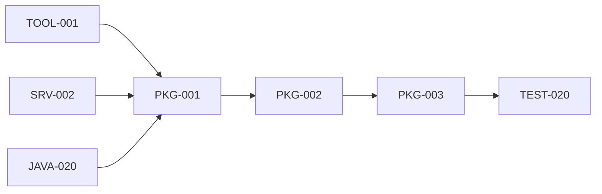

# ConceptBase.cc — rebuild task execution graph

Topological plan for greenfield reconstruction. Each node is one deliverable; edges are hard
prerequisites. Execute **layer by layer** (topological sort). Within a layer, tasks may run in
parallel unless a sub-edge says otherwise.

Archive reference: `archive/2026-06-06-wip/`

---

## Legend

| Prefix | Domain |
|--------|--------|
| `DOC` | Documentation & specifications |
| `INFRA` | Repo scaffold, Nix, CI, tooling |
| `TOOL` | Pinned third-party toolchains |
| `SRV-C` | Server C foreign-function layer (`libcb<name>` → `libcb<name>.a`) |
| `SRV-P` | Server Prolog kernel |
| `SRV` | Server binary, install layout, scripts |
| `DATA` | Ontology bootstrap & example corpora |
| `PROTO` | Wire protocol & API contracts |
| `JAVA` | Java client modules |
| `NATIVE` | C/C++ client libraries (`libcbc`, `libcbtelosclient`, `libcbcview`, …) |
| `CLI` | Launcher scripts & desktop entrypoints |
| `PKG` | Packaging (Nix outputs, Docker, release) |
| `TEST` | Verification & integration gates |

**Edge notation:** `A → B` means *A must complete before B starts*.

---

## Master DAG (all parts)

---

## Topological sort — execution layers

Tasks grouped by **minimum prerequisite depth**. Complete each layer before the next.
Within-layer order is a suggestion, not a hard constraint.

### Layer 0 — charter (start here)

| ID | Task | Archive pointers |
|----|------|------------------|
| DOC-001 | Vision & scope: what to keep, drop, modernize | `README.md`, analysis notes |
| DOC-002 | Archive inventory: file counts, hot spots, debt | whole `archive/2026-06-06-wip/` |
| INFRA-001 | Repo scaffold: `README`, `LICENSE`, `docs/` | — |

### Layer 1 — architecture & skeleton

| ID | Task | Depends on |
|----|------|------------|
| DOC-010 | Target architecture (server / clients / data / pkg) | DOC-001, DOC-002 |
| DOC-011 | Directory layout spec (`server/`, `clients/java/`, …) | DOC-010 |
| DOC-012 | Toolchain policy (SWI 6.6.6 pin, JDK 11, clang) | DOC-010 |
| DOC-013 | License & third-party audit (FlatLaf, Batik, jgl, grappa) | DOC-002 |
| INFRA-002 | Nix flake skeleton (empty outputs, `src` filter) | DOC-011, DOC-012, INFRA-001 |
| INFRA-003 | Git hygiene (ignore rules, no binaries policy) | INFRA-001 |

### Layer 2 — pinned toolchains

| ID | Task | Depends on |
|----|------|------------|
| TOOL-001 | `swi-prolog` Nix derivation (6.6.6 patches) | INFRA-002, DOC-012 |
| TOOL-002 | `cb-make` wrapper (make 4.x, `-j1`) | INFRA-002, DOC-012 |
| TOOL-003 | Java 11 + Maven reactor policy | INFRA-002, DOC-012 |
| TOOL-004 | Legacy JAR fetch (`jgl`, `grappa`) + Maven Central pins | TOOL-003, DOC-013 |
| DOC-020 | Build system guide (`nix build .#…`) | TOOL-001, TOOL-002 |

### Layer 3 — server contracts & first C lib

| ID | Task | Depends on |
|----|------|------------|
| DOC-030 | Telos data model primer | DOC-010 |
| DOC-031 | CBserver process model (ports, DB dirs, lock files) | DOC-010 |
| PROTO-001 | IPC/socket term encoding (from `BimIpc`, `CBterm`) | DOC-031 |
| DATA-001 | SYSTEM ontology extract → `ontology/system/` | DOC-030 |
| SRV-C-001 | `libcbgeneral` (C↔Prolog bridge, `unixToProlog.c`, …) → `libcbgeneral.a` | TOOL-001, TOOL-002, DOC-012 |

### Layer 4 — C bridge complete

| ID | Task | Depends on |
|----|------|------------|
| SRV-C-002 | `libcbipc` (client connection handling) → `libcbipc.a` | SRV-C-001 |
| SRV-C-003 | `libcbtelos` FFI → `libcbtelos.a` | SRV-C-001 |
| SRV-C-004 | `libcbtelosserver` → `libcbtelosserver.a` | SRV-C-003 |
| SRV-C-005 | `libcbcos` (archive `libCos` / `libCos2` / `libCos3`) → `libcbcos.a` | SRV-C-002 |
| DOC-032 | C↔Prolog FFI map (exported predicates ↔ `.c`) | SRV-C-001, SRV-C-004 |

### Layer 5 — Prolog build harness & storage core

| ID | Task | Depends on |
|----|------|------------|
| SRV-P-001 | Prolog build harness (`dcg`, `plcb`, object dirs) | TOOL-001, SRV-C-004 |
| SRV-P-002 | Module graph & `#IMPORT` / `#EXPORT` map | SRV-P-001 |
| SRV-P-003 | DCG / assertion compiler chain | SRV-P-002 |
| SRV-P-004 | BDM storage layer | SRV-P-003 |
| DOC-040 | Prolog module catalog (group by subsystem) | SRV-P-002 |

### Layer 6 — Prolog services

| ID | Task | Depends on |
|----|------|------------|
| SRV-P-010 | Query & rule engine | SRV-P-004 |
| SRV-P-011 | `CBserverInterface` / session commands | SRV-P-010, PROTO-001 |
| SRV-P-012 | Client notifications | SRV-P-011 |
| SRV-P-013 | LPI plugin interface (`cbserver.pro`) | SRV-P-011 |
| DOC-041 | Server command reference | SRV-P-011 |

### Layer 7 — CBserver runnable

| ID | Task | Depends on |
|----|------|------------|
| SRV-001 | Link `CBserver` binary | SRV-P-011, SRV-C-005 |
| SRV-002 | `linux64` install tree (`CB_Install` equivalent) | SRV-001 |
| SRV-003 | `cbserver` wrapper script | SRV-002 |
| DATA-002 | Empty DB bootstrap (`OB.telos` from SYSTEM) | DATA-001, SRV-002 |
| TEST-001 | Server smoke: `cbserver -port 4001 -d /tmp/db` | SRV-003, DATA-002 |

### Layer 8 — client protocol specification

| ID | Task | Depends on |
|----|------|------------|
| PROTO-002 | Java `CBterm` grammar & codec | PROTO-001, TEST-001 |
| PROTO-003 | Client session lifecycle (connect, ask, notify) | PROTO-002 |
| DOC-050 | Client API specification | PROTO-003 |
| DOC-051 | Port 4001 deployment guide | SRV-003 |

### Layer 9 — Java API foundation

| ID | Task | Depends on |
|----|------|------------|
| INFRA-010 | Maven parent POM + offline repo wiring | DOC-050, TOOL-003, TOOL-004 |
| JAVA-001 | `conceptbase-java-common` | INFRA-010 |
| JAVA-002 | `conceptbase-java-api` (`CBclient`, `CBterm`) | JAVA-001 |
| TEST-010 | API integration: Java client ↔ live server | JAVA-002, TEST-001, SRV-003 |

### Layer 10 — Java UI stack

| ID | Task | Depends on |
|----|------|------------|
| JAVA-010 | `conceptbase-java-telos` | JAVA-002 |
| JAVA-011 | `conceptbase-java-graph` | JAVA-010 |
| JAVA-012 | `conceptbase-java-workbench` (`CBIva`) | JAVA-011 |
| JAVA-020 | Distribution JARs (`cb.jar`, `CBinstaller.jar`) | JAVA-012 |
| DOC-060 | Workbench user guide stub | JAVA-020 |

### Layer 11 — launchers, native clients, examples

| ID | Task | Depends on |
|----|------|------------|
| CLI-001 | `cbiva`, `cbgraph`, `cbshell` launchers | JAVA-020, SRV-002 |
| NATIVE-001 | `libcbc` public headers → `libcbc.a` | PROTO-001 |
| NATIVE-002 | `libcbc` term codec | NATIVE-001 |
| NATIVE-003 | `libcbtelosclient` → `libcbtelosclient.a` | NATIVE-002 |
| DATA-010 | Ported examples (`FLIGHT`, `QUERIES`, …) | TEST-001 |
| DOC-070 | Example walkthroughs | DATA-010 |

### Layer 12 — packaging & release gate

| ID | Task | Depends on |
|----|------|------------|
| PKG-001 | Fine-grained Nix outputs (per derivation) | SRV-002, JAVA-020, TOOL-001 |
| PKG-002 | `conceptbase` aggregate install | PKG-001 |
| PKG-003 | Docker image (server trial) | PKG-002 |
| INFRA-020 | CI pipeline (build + smoke tests) | PKG-002 |
| DOC-080 | Operator runbook | PKG-003 |
| TEST-020 | End-to-end trial (server + workbench + example) | CLI-001, PKG-002, TEST-010 |

---

## Subsystem graphs

### Documentation-only spine

Write docs **just-in-time**: each doc node depends on the code it describes, except charter
docs (layers 0–1) which precede implementation.

### Server spine (critical path)

Longest path: **~11 hops** from toolchain to smoke test.

### Java client spine

Java UI cannot start until **TEST-001** proves the server speaks the protocol.

### Packaging spine

---

## Prolog internal module order (SRV-P sub-graph)

When executing SRV-P-002…013, migrate Prolog modules in this **internal topological order**
(derived from `#IMPORT` chains in `serverSources/Prolog_Files/`):

| Phase | Modules (representative) | Notes |
|-------|--------------------------|-------|
| P0 | `ConfigurationUtilities`, `ErrorMessages` | utilities, no business logic |
| P1 | `BDMCompile`, `BDMLiteralDeps`, `AssertionCompiler` | storage compiler |
| P2 | `BDMEvaluation`, `BDMForget`, `BDMKBMS` | DB manager core |
| P3 | `CodeCompiler`, `CodeStorage`, `AssertionTransformer` | code & assertions |
| P4 | `AnswerTransform`, `AnswerTransformator` | query answers |
| P5 | `CBserverInterface`, `ClientNotification` | wire protocol |
| P6 | `cbserver`, `CBprofiler` | top-level API & tools |

Re-validate this list against `#IMPORT` in the archive before each phase.

---

## Milestone gates

| Gate | Required tasks | Exit criterion |
|------|----------------|----------------|
| **M0 — chartered** | DOC-001…002, INFRA-001 | Written scope + clean repo |
| **M1 — builds nothing yet** | Layer 1 complete | Flake evaluates, layout agreed |
| **M2 — toolchains** | Layer 2 complete | `nix build .#swi-prolog` succeeds |
| **M3 — server alpha** | TEST-001 | CBserver accepts TCP on 4001 |
| **M4 — API proven** | TEST-010 | Java `CBclient.connect()` works |
| **M5 — GUI alpha** | JAVA-020, CLI-001 | `cbiva` opens against live server |
| **M6 — shippable** | TEST-020, PKG-003 | Docker trial runs end-to-end |

---

## Parallelism hints

| Can run in parallel (same layer) | Must stay sequential |
|----------------------------------|----------------------|
| DOC-011 + DOC-012 + DOC-013 | SRV-P phases P0→P6 |
| TOOL-001 + TOOL-002 + TOOL-003 | JAVA-010 → JAVA-011 → JAVA-012 |
| SRV-C-002 + SRV-C-003 (after SRV-C-001) | TEST-001 before any Java work |
| NATIVE-* branch alongside JAVA-* after Layer 8 | PKG-002 after both server + java |

---

## Next action

**Start Layer 0:** create `DOC-001` (vision/scope) and `INFRA-001` (directory scaffold per
`DOC-011` draft). Do not port code until **M1** is signed off.
